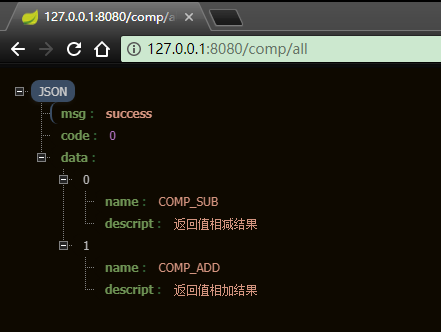
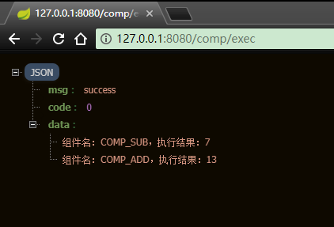

# spring下动态注册组件的一种简单的解决思路

工作中，实现组件自动注册的方法有不少，其中使用jdk自带的 Service Provider Interface（SPI）也很简单。如果你使用spring框架，我在这里提供另外一种思路。依赖于spring的组件扫描和注册功能，15行代码不到实现自动注册组件功能。最近一个项目中使用了这种方式，代码非常简单，目前看来没有什么大问题。

# 定义组件接口

新建一个项目，定义接口。

```Java
package cn.xiaowenjie;

/**
 * 组件接口类
 * 
 * @author 肖文杰 https://github.com/xwjie/DynamicComponentDemo
 *
 */
public interface IComponent {

  String getName();

  String getDescript();

  int doSomeThing(int i, int j);
}
```

另外，由于要依赖spring，所以把spring依赖放到这个公共的接口项目中，这样其他实现接口的项目就不再需要单独加依赖了。

# 实现自己的组件

非常简单，新建一个项目。引入接口项目的依赖，实现接口即可。需要在组件上增加 `@Component` 。


```Java
package cn.xiaowenjie;

import org.springframework.stereotype.Component;

/**
 * 测试组件1
 * 
 * @author 晓风轻 https://github.com/xwjie/DynamicComponentDemo
 *
 */
@Component
public class MyComponent1 implements IComponent {

  public String getName() {
    return "COMP_ADD";
  }

  public String getDescript() {
    return "返回值相加结果";
  }

  public int doSomeThing(int i, int j) {
    return i + j;
  }

}
```

# 主工程

新建主项目，让spring找到所有实现了接口的组件即可。其实就2行代码。需要加 `required = false` ,否则没有任何组件的时候会报错。

```Java
  @Autowired(required = false)
  List<IComponent> components;
```


完整代码：


```Java
package cn.xiaowenjie.controllers;

import java.util.ArrayList;
import java.util.List;

import org.springframework.beans.factory.annotation.Autowired;
import org.springframework.stereotype.Component;
import org.springframework.web.bind.annotation.GetMapping;
import org.springframework.web.bind.annotation.RequestMapping;
import org.springframework.web.bind.annotation.RestController;

import cn.xiaowenjie.IComponent;
import cn.xiaowenjie.beans.ResultBean;

/**
 * 测试类
 * 
 * @author 肖文杰 https://github.com/xwjie/DynamicComponentDemo
 *
 */
@RequestMapping("/comp")
@RestController
public class MainController {

  @Autowired(required = false)
  List<IComponent> components;

  /**
   * 查看所有组件
   * 
   * @return
   */
  @GetMapping("/all")
  public ResultBean<List<IComponent>> all() {
    return new ResultBean<List<IComponent>>(components);
  }

  /**
   * 测试执行结果
   * 
   * @return
   */
  @GetMapping("/exec")
  public ResultBean<List<String>> exec() {
    List<String> outputs = new ArrayList<String>();

    if (components != null) {
      for (IComponent comp : components) {
        outputs.add("组件名：" + comp.getName() + "，执行结果：" + comp.doSomeThing(10, 3));
      }
    }

    return new ResultBean<List<String>>(outputs);
  }
}
```

在主工程引入实现的组件项目：


测试结果：





# 指定组件的顺序

使用 `@Order` 注解即可。

```Java
@Component
@Order(1)
public class MyComponent2 implements IComponent
```

# 总结

使用spring的自动扫描注册，实现起来非常简单，最终发布的时候也很方便，把组件的工程打成jar包扔进去即可。